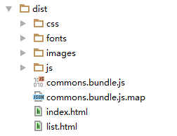

# webpackMultipageTool

基于webpack和node搭建多页html的脚手架。现在多数的开发都是SPA模式，少有多页的开发，有的多页开发也是自己需要配置很多的参数。

分生产环境和开发环境，可使用sass编辑样式，生产环境可进行代码压缩，自动注入依赖。

# 安装方法

1. npm install 安装依赖

2. npm run dev 开发环境

3. npm run build 导出生产环境

# 使用方法

1. 在app目录进行开发，按照正常的html逻辑处理即可

2. 在app/html 目录和 app/js 目录里创建同名的js文件和html文件

3. 图片和字体按照相对路径处理即可

4. 设置config/config.js里的HTMLDirs里为html文件的名字，运行npm run build即可

5. 可在html内用#include("./header.html")的方式实现引入公共的头部和底部

# 文件目录

app -> 开发目录

dist -> 导出的生产环境的目录

config -> 相关的配置信息

fonts -> 字体和图标文件

# demo
1. app -> 源代码，新建HTML和js文件；index.html引入header.html。
`#include("./header.html")
`

2. 修改config/config.js里的配置信息。
`module.exports = {
        HTMLDirs: [
            "index",
            "list"
        ],
        //配置新建的html文件的名字
     }`

3.运行npm run build 即可看生产出了dist目录，结构如下：

# 说明

默认已经安装jquery 和 bootstrap